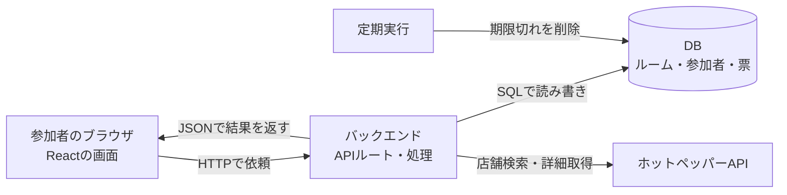

# MoguMatchを自分で開発できるようになるための学習ガイド

2026-09-30時点の実際のコードに沿った教材です。公開やデプロイは行いません。提供元への問い合わせの返答を待ちながら、ローカルで学習します。

## 1. 到達目標

最初から全部のコードを暗記する必要はありません。次の4つを順番に目指します。

1. ボタンを押したとき、どのファイルで何が起きるか追える。
2. 画面の文章・表示・操作を自分で変更できる。
3. 入力チェックやDB保存まで含む機能を1つ追加できる。
4. 架空の店舗3件を使った小さな投票アプリを、自分で作り直せる。

完成したコードを読むだけでなく、「予想する → 小さく変更する → 動かす → 結果を説明する」を繰り返します。

## 2. Webアプリの全体像



**フロントエンド**は、利用者が触る画面です。文字、写真、入力欄、ボタン、スワイプ操作を扱います。

**バックエンド**は、ブラウザからの依頼を受け、入力と権限を確認して処理する側です。「この人はホストか」「締め切り後ではないか」などを判断します。

**データベース（DB）**は、複数人で共有する情報の保存先です。画面を再読み込みしても、ルームや投票を取り出せます。

**インフラ**は、それらを動かす場所と仕組みです。公開用の実行環境、DB、秘密情報の設定、定期実行などを含みます。

**外部API**は、別のサービスに決まった形式で処理やデータ取得を依頼する窓口です。MoguMatch自身のAPIとホットペッパーAPIは別物です。

現在は自分のPC上で動かしています。Cloudflare向けの構成・ビルドはありますが、公開環境で動作中という意味ではありません。`localhost`はアクセスしている端末自身を指すため、友人のスマホにlocalhostのリンクを送っても、自分のPCにはつながりません。

## 3. 今回の技術スタック

バージョンはこのプロジェクトのpackage.jsonの指定値であり、最新バージョンの紹介ではありません。

| 技術 | 今回の役割 | 学ぶ順番 |
|---|---|---|
| HTML / JSX | 見出し、ボタン、入力欄など画面の構造 | 最初 |
| CSS | 色、余白、並び方、スマホ表示 | 最初 |
| JavaScript | 条件分岐、配列処理、クリック時の処理 | 最初 |
| TypeScript 5.9.3 | データの形を型で表し、間違いを開発中に見つける | JSの基礎の次 |
| React 19.2.6 | 状態に応じて画面を更新する | JSの基礎の次 |
| Vinext 1.0.0-beta.5 / Vite 8.0.13 | Next.js互換の構成で画面・APIを動かし、開発・ビルドする | 概要から |
| Next 16.3.4 | 互換構成で使うAPI・型などの依存関係 | 必要な箇所だけ |
| Cloudflare Workers | 公開時にサーバー処理を実行する想定の環境 | バックエンドの次 |
| Cloudflare D1 / SQLite系SQL | ルーム・参加者・票を保存する | 通信の次 |
| Drizzle ORM 0.45.2 / Drizzle Kit 0.31.10 | テーブル定義とDB変更ファイルの管理 | SQLの基礎の次 |
| Wrangler / Cloudflare Vite plugin | WorkersとD1をPC上で動かす・ビルドする道具 | まず起動方法だけ |
| Tailwind CSS 4.2.1 / UI部品 / Lucide | 画面部品のスタイル・選択欄・ダイアログ・アイコン | 使う箇所から |
| ホットペッパーWebサービス | 実店舗情報の取得 | 架空データで完成してから |

注意：今回の実際のDB操作は、主に`env.DB.prepare(...).bind(...).run()`などのD1 APIとSQLで書いています。Drizzleのクエリで全処理を書いているわけではありません。

`package.json`にはスターター由来の未使用ライブラリも含まれています。全部を学ぶ必要はありません。またVinextはこの構成ではベータ版です。この構成だけがWebアプリの作り方ではなく、他のフレームワークにも共通する基礎を先に身に付けます。

## 4. 最初に読むファイル

| ファイル | 読む目的 |
|---|---|
| `app/page.tsx` | トップページがMoguAppを表示することを知る |
| `app/mogu-app.tsx` | フォーム、待機、投票、結果画面を読む |
| `app/globals.css` | 見た目の設定を読む |
| `lib/restaurants.ts` | 店舗データの型、架空データ、表示用関数を読む |
| `lib/room-types.ts` | 画面が受け取るルーム情報の形を読む |
| `app/api/rooms/route.ts` | ルーム作成依頼の入口を見る |
| `app/api/rooms/[id]/route.ts` | 特定のルームの参加・投票依頼の入口を見る |
| `lib/room-server.ts` | 本人確認、権限、保存、集計の本体を読む |
| `db/schema.ts` | テーブルと一意制約を読む |
| `lib/hotpepper.ts` | 外部APIへの通信と受信データの扱いを読む |
| `lib/candidate-storage.ts` | DBに保存する情報を最小限に絞る処理を読む |
| `lib/request-guards.ts` | 入力制限と1時間の期限を読む |
| `lib/room-cleanup.ts` / `worker/index.ts` | 定期削除の本体と呼び出し口を読む |

`.ts`はTypeScript、`.tsx`は画面の記述（JSX）を含められるTypeScriptです。`import`は別ファイルの機能を読み込む指定です。`@/`はこのプロジェクトのルートを表す設定になっています。

`node_modules`は外部ライブラリ、`dist`はビルド結果です。最初に読むのは自分たちの`app`と`lib`です。生成物を直接直すと、次のビルドで上書きされます。

## 5. 「いいね」を押した後を追ってみる

ここを説明できるようになると、全体のつながりが見えてきます。

1. `app/mogu-app.tsx`のボタンが`vote(true)`を呼びます。`true`は「いいね」、`false`は「今回は選ばない」を表します。
2. `vote()`が、対象の店舗IDを添えて`act()`を呼びます。
3. `act()`から`api()`に渡し、`fetch()`でサーバーへPOSTリクエストを送ります。
4. `/api/rooms/[id]`のルートが、そのルームIDを取り出して`handleRoom()`に渡します。
5. バックエンドがCookieから参加者を識別し、ルームの期限、参加資格、投票内容、受付状態を確認します。
6. DBに自分の票を保存します。同じルーム・参加者・店舗の組み合わせは1件だけになる制約があります。
7. 最新の票を集計し、JSONを返します。
8. フロントエンドが`setRoom()`で状態を更新し、Reactが次のお店や進捗を表示します。
9. 他の参加者は約3秒ごとの状態取得で変更を受け取ります。WebSocketによる即時配信は使っていません。

送信データの例（説明用の架空ID）：

```json
{
  "action": "vote",
  "restaurantId": "sample-curry",
  "liked": true
}
```

HTTPは通信の方法、URLは依頼先、POSTは処理を依頼する際のメソッド、JSONはデータの表現形式です。`await`は通信の完了を待ち、完了後の処理へ進むために使っています。その間、アプリ全体を止めるという意味ではありません。

フロントエンドでボタンを無効化するだけでは不十分です。画面を経由せずAPIへ依頼を送ることもできるため、バックエンドでも必ず確認します。

## 6. フロントエンドの基礎を今回のコードで学ぶ

### コンポーネント

Reactの画面部品です。`Choice`は選択欄、`FoodPhoto`は写真部分、`MoguApp`は全体を組み合わせる部品です。部品に渡す値をpropsと呼びます。

```tsx
// 説明用の小さな例。本体へ追加する必要はありません。
function Greeting({ name }: { name: string }) {
  return <p>こんにちは、{name}さん</p>;
}
```

`{name}`には変数の値が表示されます。HTMLに似ていますが、この書き方はJSXです。

### 状態（state）

入力した名前や取得したルームのように、操作によって変わる値です。

```tsx
const [name, setName] = useState("");
```

`name`が現在の値、`setName`が更新のための関数です。`setName("けいた")`とすると、Reactが新しい状態に基づいて画面を更新します。

### 入力とイベント

```tsx
<input value={name} onChange={event => setName(event.target.value)} />
```

利用者の入力を状態に保存し、その状態を入力欄へ表示しています。`onClick`はクリック、`onSubmit`はフォーム送信のイベントです。

### 配列と画面

`map()`は各データを画面部品などに変換し、`filter()`は条件に合うデータを残し、`find()`は条件に合う最初の1件を探します。現在の投票対象は「自分がまだ投票していない最初の店舗」を`find()`で選んでいます。

### useEffectとuseRef

`useEffect`は通信やタイマーなど、画面を計算する以外の処理を開始・終了する場所として使っています。タイマーを解除しないと、再表示のたびに処理が増える問題が起きます。

`useRef`は、値を保持しつつ、その更新だけでは再描画を起こしたくない場合などに使っています。このアプリでは通信中フラグやスワイプ開始位置などに使います。まず`useState`を理解し、必要になってから違いを学べば十分です。

## 7. バックエンドとDBを分けて理解する

バックエンドは判断・処理を行い、DBはデータを保存・検索します。

| テーブル | 保存するもの | 例 |
|---|---|---|
| rooms | ルーム、検索条件、状態、候補の参照情報、作成時刻 | ルームA、投票受付中 |
| members | 参加者、所属ルーム、セッションのハッシュ、ホストかどうか | ルームAのけいた |
| votes | 誰がどの店舗にどう投票したか | けいた→店舗X→いいね |
| create_limits | 作成回数の制限に使うカウンター | セッション別・全体の上限 |

1つのルームに複数の参加者がいて、1人が複数の店舗に投票します。これをIDで結び付けます。名前は変更や重複があり得るため、識別にはIDを使います。

SQLはDBを操作する言語です。

```sql
-- 説明用。?にはプログラム側から値を渡します。
SELECT * FROM rooms WHERE id = ?;
```

`SELECT`は取得、`INSERT`は追加、`UPDATE`は更新、`DELETE`は削除です。入力値をSQLの文字列へ直接つなげず、`bind()`で渡します。

主キーは行を識別する値です。votesでは「ルームID・参加者ID・店舗ID」の組み合わせを主キーにしています。複数回クリックしても同じ参加者の票が2件に増えないよう、DBでも守っています。

`db/schema.ts`を書き換えるだけでは、既存のDBは変わりません。変更を適用するSQLファイルがマイグレーションです。`drizzle/`に順序付きで保存されています。既存の適用済みファイルを書き換えるのではなく、新しい変更を追加します。

## 8. 会員登録がないのに、なぜ本人が分かるのか

バックエンドがランダムなトークンをCookieに設定し、ブラウザはその後の同じサイトへの通信でCookieを送ります。DBにはそのトークンのハッシュを保存し、参加者と照合します。

Cookieはブラウザ側に保存する小さな値です。今回はHttpOnlyを指定しており、画面のJavaScriptから直接読み取らせません。ハッシュ化は値から一定の形式の値を計算する処理で、元に戻す前提の暗号化とは違います。

ルームのURLと本人を識別するCookieは別です。リンクを知っていてもホストになれるわけではありません。同じブラウザの別タブは通常同じCookieを共有するため、別人のテストには別ブラウザ等を使います。

Cookieを消すと本人として復帰できない、ホスト不在では締切操作ができない、といった制約もあります。何を実現し、何をまだ実現していないかを理解することも設計の勉強です。

## 9. 外部API・保存・インフラ

APIキーは`.dev.vars`に置き、サーバー側の`env`から読みます。ブラウザが直接ホットペッパーを呼ぶ構成にはしていません。画面へ渡したキーは利用者に見えるためです。

現在の検索方式は2つです。

- 地名・住所：提供元のキーワード検索。指定した住所を中心とする半径検索ではありません。
- 現在地：ブラウザの許可を得て位置を取得し、その地点の周辺を検索。0.5〜3kmの半径区分で表示します。

提供元の予算はディナーの目安なので、ランチの価格とは扱いません。予算を指定しなければ、その条件では絞り込みません。

店舗名・写真URLなどの詳細はDBに保存せず、表示時に店舗IDから取得します。投票状況だけの通信では店舗APIを再取得せず、画面にある詳細と新しい集計を合わせています。`mergeRoomState()`がこの役割です。

```text
開発用PC
  Node.jsが開発ツールを起動
  Viteが変更を検知
  Workersのローカル実行環境がAPIを処理
  ローカルD1がデータを保存

公開時に必要なもの（まだ公開していない）
  HTTPSでアクセスできる公開先
  サーバー処理の実行環境とDB
  APIキー等の秘密設定
  定期削除の登録・確認
  利用量・障害・バックアップの運用
```

Node.jsはJavaScriptをブラウザの外で動かす実行環境です。今回の公開用バックエンドはWorkers向けなので、「Node.jsで起動したから本番もNode.jsサーバー」とは限りません。

ビルドはコードを配布・実行用の形に整える作業です。デプロイはその成果物を公開先へ反映する作業です。ビルド成功だけでは、公開先のDBや定期実行が正しく設定されていることまでは分かりません。

ルームは作成から1時間で利用できなくなります。削除は毎分の定期処理で行います。ローカルではVite稼働中のみ自動実行します。本番のスケジュール登録はまだです。停止中の削除遅延やバックアップの扱いも運用設計に含まれます。

## 10. 自分で作り直すなら、この順番

| 段階 | 作るもの | 学ぶ内容 | 完了の目安 |
|---|---|---|---|
| 1 | 架空のお店1件のカード | HTML・CSS | 名前・写真・説明・ボタンを表示できる |
| 2 | ボタンで表示が変わる画面 | JS・Reactの状態 | いいねを押すと表示が変わる |
| 3 | 架空の3店舗を順番に選ぶ | 配列・条件分岐 | 3件選ぶと結果を表示できる |
| 4 | 前に戻る・選び直す | 状態の設計 | 取り消しても票が二重にならない |
| 5 | サーバーに保存依頼を送る | HTTP・JSON・async/await | 通信の成功と失敗を表示できる |
| 6 | DBにルームと票を保存 | SQL・ID・制約 | 再読み込みしても票が残る |
| 7 | 別ブラウザから参加 | Cookie・権限・共有 | 2人が別々に投票できる |
| 8 | 集計・締切・期限 | 状態遷移・タイマー | 締切後や期限後に変更できない |
| 9 | 実店舗APIへ接続 | 外部通信・秘密情報・利用条件 | 失敗時も架空データにすり替わらない |
| 10 | 公開前の整備 | インフラ・テスト・運用 | 秘密情報、データ削除、費用条件を説明できる |

最初の段階ではスワイプより先に普通のボタンで完成させます。左右のスワイプも、最終的には同じ投票関数を呼ぶ別の操作方法です。

現行の`mogu-app.tsx`は大きいので、一度に読むと難しく感じます。理解が進んだら「作成フォーム」「待機画面」「投票カード」「結果画面」を別コンポーネントへ分ける練習ができます。今回は説明のためにアプリを分割・書き換えてはいません。

## 11. 最初の実習：画面の一文を自分で変える

### 起動

PowerShellで次を実行します。すでにサーバーが動いている場合は、その画面を利用します。

```powershell
cd C:\Users\keita\jphacks\mogumatch
.\start-dev.cmd
```

表示されたLocalのURLをブラウザで開きます。通常は`http://localhost:5173/`です。ターミナルは開いたままにします。

### 読んで、予想して、変更

1. `app/page.tsx`を開き、`MoguApp`を表示している箇所を見つける。
2. `app/mogu-app.tsx`を開き、「お店選びを、もっと気軽に。」を検索する。
3. その一文だけを「みんなで、今日のお店を決めよう。」へ変更する。
4. 保存して画面がどう変わるか確認する。反映されなければ再読み込みする。
5. 「この変更でDBを書き換える必要がないのはなぜか」を自分の言葉で説明する。
6. 元の文へ戻して保存する。

この実習はAPIキーを読んだり、ルームを作成したりする必要がありません。該当する画面部分以外は変更しません。

### 確認問題

- `page.tsx`と`mogu-app.tsx`の役割はどう違うか。
- 画面の文章を変えることと、投票の記録を変えることは何が違うか。
- ブラウザで更新した表示を、他の参加者へ伝えるには何が必要か。

回答の目安：`page.tsx`はページの入口、`MoguApp`が画面と操作を組み立てます。固定の文言はソースコードの変更であり、利用者ごとの保存データの更新ではありません。参加者間の共有にはサーバーと共通の保存先、他の画面が取得する仕組みが必要です。

## 12. 次の練習と確認方法

最初の実習ができたら、架空店舗データで「3件を順番に表示」「いいね数を表示」を作る練習へ進みます。実店舗データの取得や利用条件は、その後に扱えます。

バグが起きたら、次の順番で見ます。

1. 画面：何をしたとき、何を期待し、何が起きたか。
2. ブラウザのConsole：JavaScriptのエラーがあるか。
3. Network：リクエストが送られたか、HTTPステータスと応答は何か。
4. サーバーのターミナル：バックエンドで失敗していないか。
5. DB：保存した値と取得した値が一致するか。

Networkでは自分のローカル通信だけを観察します。Cookie等を含む通信全体をそのまま公開しないようにします。

型チェックはTypeScriptの矛盾を、ビルドは組み立てられるかを確認します。どちらも、アプリの動作が正しいことをすべて保証するものではありません。

既存のテストは教材として読めます。

- `scripts/check-guards.mjs`：不正な入力、予算、距離区分、保存内容など。
- `scripts/check-undo.mjs`：2人の投票と取り消し。他人の票が変わらないこと。
- `scripts/check-room-cleanup.mjs`：1時間の境界と削除。メモリ内のテストDBを使用。
- `scripts/check-scheduled-cleanup.mjs`：定期削除の実動作。ローカルDBにテストデータを作ります。

最初から全テストを実行する必要はありません。変更した機能に合うものを選びます。実APIを使うテストはアクセス回数を消費します。

## 13. 学習の進め方

各回は「1つの仕組み」「1つの変更」「1つの説明」に絞ります。

コーディには、例えば「今回は答えのコードをすぐ書かず、ヒントから教えて」「この関数を1行ずつ説明して」「自分で書いた変更をレビューして」と依頼できます。

理解の基準は、コードを見て分かった気がすることではなく、入力と出力を予想し、小さな変更の影響を説明できることです。最初の到達点は、架空の3店舗を1人で選べるアプリです。そこから通信・DB・複数人参加を一つずつ足して、MoguMatchの構成につなげます。
